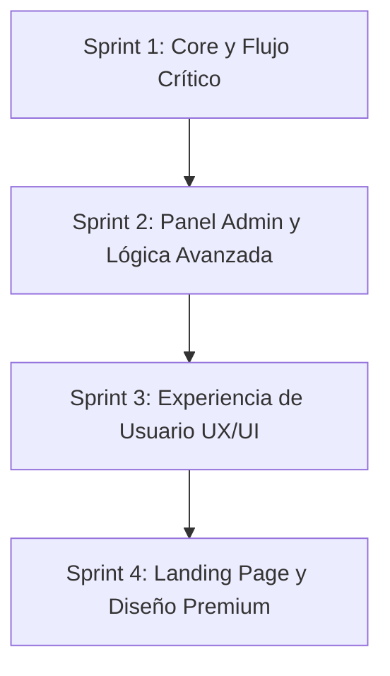

# ✂️ Peludos Barber Shop — Documentación Completa del Proyecto
> **Estado del Proyecto:** Sprint 4 Completado (Fase de Estabilización y UX)  
> **Última Actualización:** Junio 2026  
> **Autor:** Equipo de Desarrollo · Sistema Clientes Servidor (Octavo Semestre)

---

## 1. 📖 Introducción y Propósito del Sistema

**Peludos Barber Shop** es una plataforma web integral diseñada para optimizar y modernizar el flujo de reservaciones de una barbería premium. A través de este sistema, los clientes pueden agendar citas de forma interactiva seleccionando servicios y barberos específicos, mientras que los barberos y los administradores cuentan con paneles privados dedicados para la gestión de la agenda, reportes financieros, control de personal y administración de catálogo de servicios.

---

## 2. 🛠️ Stack Tecnológico

El proyecto está construido sobre tecnologías modernas orientadas a la web de alto rendimiento y una experiencia de usuario fluida:

*   **Frontend (Cliente):**
    *   **React (v18.3.0) + Vite:** Framework ágil para la construcción de interfacesSPA rápidas.
    *   **React Router DOM (v6.23.0):** Gestión de rutas protegidas y navegación sin recargas.
    *   **CSS Vanilla:** Hojas de estilo personalizadas con un enfoque de diseño *dark/gold* (oro sobre fondo oscuro) para una estética elegante y premium.
    *   **Recharts (v3.8.1):** Visualización de datos estadísticos a través de gráficos responsivos.
    *   **jsPDF & jsPDF AutoTable:** Generación de reportes y exportación en formato PDF de forma local.
    *   **Date-fns:** Utilidades de manipulación de fechas en JavaScript.
*   **Backend & Base de Datos:**
    *   **Supabase:** Base de datos relacional Postgres administrada, que provee autenticación de usuarios, base de datos en tiempo real y seguridad a nivel de filas (RLS).
    *   **Supabase Auth:** Control seguro de sesiones de usuario con registro e inicio de sesión integrados.

---

## 3. 🗄️ Arquitectura y Schema de la Base de Datos

La base de datos PostgreSQL en Supabase está estructurada para soportar la integridad referencial y el flujo operativo de la barbería. A continuación, se detalla el esquema de las tablas principales que se han implementado:

### A. Tabla: `profiles`
Almacena la información extendida de los usuarios autenticados.
*   `id` (UUID, Primary Key, referencias a `auth.users.id`): Identificador único ligado a la cuenta de autenticación.
*   `full_name` (Text): Nombre completo del cliente, barbero o administrador.
*   `phone` (Text, Opcional): Teléfono de contacto.
*   `birthdate` (Date, Opcional): Fecha de nacimiento (útil para campañas de fidelización).
*   `role` (Text): Rol de acceso dentro del sistema. Valores permitidos: `'client'`, `'admin'`, o `'barber'`.

### B. Tabla: `barbers`
Registra al personal activo de la barbería.
*   `id` (UUID, Primary Key): Identificador único del barbero.
*   `profile_id` (UUID, Foreign Key a `profiles.id`): Relación directa con el perfil de usuario.
*   `bio` (Text): Breve presentación o especialidad del barbero.
*   `is_active` (Boolean): Indica si el barbero está disponible para recibir citas.
*   `schedule` (JSONB): Estructura de días laborables y horas de entrada/salida (ej. Lunes a Sábado de 10:00 a 20:00).
*   `created_at` (Timestamp): Fecha de creación del registro.

### C. Tabla: `services`
Contiene el catálogo de cortes y tratamientos ofrecidos al público.
*   `id` (UUID, Primary Key): Identificador único del servicio.
*   `name` (Text): Nombre del servicio (ej. "Corte Clásico", "Arreglo de Barba").
*   `description` (Text): Detalles del servicio.
*   `price` (Numeric): Costo del servicio.
*   `duration_min` (Integer): Duración estimada en minutos.
*   `is_active` (Boolean): Estado activo/inactivo del servicio en el catálogo.

### D. Tabla: `appointments`
La tabla central donde se registran todas las reservaciones.
*   `id` (UUID, Primary Key): Identificador único de la cita.
*   `client_id` (UUID, Foreign Key a `profiles.id`): Cliente que agenda la cita.
*   `barber_id` (UUID, Foreign Key a `barbers.id`): Barbero asignado.
*   `service_id` (UUID, Foreign Key a `services.id`): Servicio agendado.
*   `scheduled_at` (Timestamp with time zone): Fecha y hora de inicio de la cita.
*   `ends_at` (Timestamp with time zone): Fecha y hora calculada de fin de la cita (basado en la duración del servicio).
*   `duration_min` (Integer): Copia o registro de la duración en minutos al momento de reservar.
*   `status` (Text): Estado de la cita. Valores: `'pending'` (pendiente), `'accepted'` (confirmada), `'completed'` (completada), `'cancelled'` (cancelada).
*   `notes` (Text, Opcional): Comentarios o solicitudes especiales del cliente.
*   `created_at` (Timestamp): Fecha y hora de creación de la reservación.

---

## 4. 📈 Historial de Desarrollo por Sprints

El proyecto ha seguido una metodología ágil por fases (Sprints) para asegurar que cada entrega añadiera valor real y estuviera probada.



### 🔹 Sprint 1: Flujo Crítico y Core del Negocio
*   **Autenticación Unificada (`Login.jsx`):** Creación de un formulario elegante en una única vista que alterna suavemente entre inicio de sesión y registro de cuentas.
*   **Gestión de Perfil (`Profile.jsx`):** Primer borrador para que el usuario pueda configurar y actualizar su información básica.
*   **Estructura de Navegación (`Navbar.jsx`):** Creación del menú adaptable y responsivo que cambia dinámicamente según si el usuario es cliente, barbero o administrador.
*   **Primer Agendamiento (`BookAppointment.jsx`):** Flujo para que los usuarios logueados elijan servicio, barbero, fecha y hora.

### 🔹 Sprint 2: Panel de Control y Lógica de Negocio Avanzada
*   **Botón de Confirmación de Citas:** Permite a los administradores aceptar citas que entran en estado `'pending'` y cambiarlas a `'accepted'` (Confirmada).
*   **Cálculo de Horarios Reales de Servicios:** Incorporación del campo `duration_min` a la base de datos y al formulario de creación de servicios. El selector de citas lee este parámetro para calcular dinámicamente la hora de término de la cita (`ends_at`), optimizando la agenda de la barbería.
*   **Historial de Citas por Cliente:** En la pestaña "Clientes" del administrador, se agregó el botón **"Ver historial"**, que despliega un modal interactivo con todas las visitas históricas del cliente, sus consumos y estados de citas.
*   **Gráficos Estadísticos e Informes (`Reports.jsx`):** Integración de `recharts` para mostrar visualmente los ingresos diarios de la barbería (gráfico de líneas) y la distribución del estado de las citas (gráfico circular/pastel).
*   **Horarios Flexibles de Barberos:** Implementación de la configuración de horarios laborables semanales para cada barbero a través de un panel interactivo (`ManageBarbers.jsx`), almacenado en formato JSON en Supabase.

### 🔹 Sprint 3: Pulido de Experiencia de Usuario (UX/UI)
*   **Mis Citas Filtrado por Pestañas (`MyAppointments.jsx`):** Organización de la agenda del cliente dividida en pestañas claras: *Todas*, *Próximas*, *Completadas* y *Canceladas*. Además, se incluyó la visualización directa del precio del servicio.
*   **Notas para el Barbero:** Adición de un campo de texto opcional en el formulario de reservación para que el cliente detalle preferencias específicas sobre su corte.
*   **Validación de Fechas en el Pasado:** Se restringió el calendario en `BookAppointment.jsx` para deshabilitar la selección de fechas anteriores a la fecha actual.
*   **Paginación Visual de Datos:** Estabilización de las tablas de administración para manejar de forma paginada y controlada la información en pantalla.

### 🔹 Sprint 4: Imagen Corporativa y Acceso Público
*   **Rediseño Premium del Home (`Home.jsx`):** Estilo sobrio y lujoso con un Hero de fondo oscuro y degradados dorados que transmiten profesionalismo.
*   **Sección Dinámica "Nuestros Barberos":** Consulta directa a la base de datos para mostrar las tarjetas con foto, nombre e información de los barberos activos.
*   **Catálogo de Servicios Público (`Services.jsx`):** Página accesible sin autenticación que renderiza tarjetas detalladas de los servicios vigentes con su precio y duración, ordenados de forma ascendente por precio.
*   **Botones Call to Action (CTA):** Enlaces directos e intuitivos para invitar a los visitantes a registrarse y agendar su cita de inmediato.

---

## 5. 🎯 Estado Actual de Tareas: Completado vs. Pendientes

A continuación se presenta el balance del tablero de control de tareas sprint para visibilizar lo desarrollado y aquello que quedó inconcluso o requiere un desarrollo posterior:

### ✅ Desarrollado Correctamente y Funcionando
*   [x] Flujo de autenticación (Login / Registro / Recuperación visual) y manejo de roles.
*   [x] Panel de Perfil de usuario funcional (actualiza nombre, teléfono y contraseña directamente en Supabase Auth y base de datos).
*   [x] Catálogo público de servicios interactivo y ordenado.
*   [x] Sección dinámica de presentación de barberos activos en el Home.
*   [x] Sistema dinámico de reservación de citas con bloqueo de fechas pasadas y cálculo de hora de término automática.
*   [x] Panel de Administrador interactivo dividido por pestañas (Citas, Clientes, Reportes, Barberos, Servicios).
*   [x] Registro de horas laborables por barbero e interfaz gráfica para su edición en el Panel Admin.
*   [x] Historial detallado de servicios y citas por cliente en un modal interactivo.
*   [x] Módulo de reportes gráficos financieros e indicadores utilizando la librería Recharts.
*   [x] Exportación de reportes de citas en PDF formateado mediante jsPDF.
*   [x] Panel del Barbero (`BarberAgenda.jsx`) para que cada empleado vea sus citas del día, cambie su estado a completado/cancelado y controle su propia agenda.

### ⚠️ Pendiente, Inconcluso o No Implementado
*   [ ] **Notificaciones por correo automatizadas:** Falta implementar las Supabase Edge Functions que conecten el sistema con Resend para el envío automático de confirmaciones y recordatorios de citas de forma pasiva.
*   [ ] **Notificaciones de WhatsApp:** Integración de Twilio/WhatsApp Business API para recordatorios inmediatos directo al móvil del cliente.
*   [ ] **Bloqueo manual de horas individuales (blocked_slots):** Actualmente, no existe la tabla `blocked_slots` en base de datos. Los barberos no pueden marcar una hora del día específica como "ocupada por razones personales" (solo pueden deshabilitar el día entero en su horario).
*   [ ] **Sistema de Fidelización y Puntos:** Aunque la columna `birthdate` está lista en profiles, la lógica de sumar puntos por cada corte completado (`loyalty_points`) y canjearlos por descuentos aún no se ha codificado en frontend ni backend.
*   [ ] **Calificación y Reseñas de Servicios:** No se ha construido la tabla de reseñas ni la interfaz del cliente para puntuar a su barbero con estrellas tras un corte completado.
*   [ ] **Calendario Semanal Visual (Admin):** El componente `WeeklyCalendar.jsx` sigue vacío (0 bytes). Los administradores ven las citas en formato de tabla con filtros, pero no en una cuadrícula semanal visual tipo agenda.

---

## 6. 📁 Mapa de Estructura del Código

Para orientar a los desarrolladores en la navegación de la base de código, este es el árbol estructurado del directorio `src/` del proyecto:

*   📂 `src/`
    *   📂 `lib/`
        *   📄 `supabaseClient.js` — Inicialización y exportación del cliente de base de datos Supabase.
    *   📂 `context/`
        *   📄 `AuthContext.jsx` — Proveedor global de autenticación, sesión y roles (`client`, `admin`, `isBarber`).
    *   📂 `utils/`
        *   📄 `dateHelpers.js` — Formateadores y parseadores de fechas.
        *   📄 `overlapCheck.js` — Helper para detectar si se sobreponen dos citas del mismo barbero.
    *   📂 `components/`
        *   📂 `layout/`
            *   📄 `Navbar.jsx` — Barra de navegación responsive con control de rutas por rol.
            *   📄 `ProtectedRoute.jsx` / `AdminRoute.jsx` / `BarberRoute.jsx` — Protectores de rutas de React Router.
        *   📂 `ui/`
            *   📄 `BarberCard.jsx` — Componente tarjeta para el Home.
            *   📄 `ServiceCard.jsx` — Componente tarjeta para la vista pública de servicios.
        *   📂 `admin/`
            *   📄 `ReportChart.jsx` — Gráficos financieros integrando Recharts.
            *   📄 *Archivos pendientes de desarrollo:* `WeeklyCalendar.jsx` (vacío).
    *   📂 `pages/`
        *   📄 `Home.jsx` — Landing page de la barbería.
        *   📄 `Login.jsx` — Formulario de Login y Registro.
        *   📄 `Services.jsx` — Catálogo público de servicios.
        *   📄 `BookAppointment.jsx` — Formulario de reservación interactivo.
        *   📄 `MyAppointments.jsx` — Citas del cliente agrupadas por pestañas de estado.
        *   📄 `AppointmentDetails.jsx` — Vista de detalle y cancelación de citas agendadas.
        *   📄 `Profile.jsx` — Gestión de datos de la cuenta.
        *   📂 `barber/`
            *   📄 `BarberAgenda.jsx` — Agenda individualizada y controles del barbero.
        *   📂 `admin/`
            *   📄 `Dashboard.jsx` — Panel contenedor principal de administrador.
            *   📄 `ManageAppointments.jsx` — Gestión, filtrado, confirmación y descarga en PDF de citas generales.
            *   📄 `ManageBarbers.jsx` — Altas, bajas e interfaz de configuración de horarios semanales.
            *   📄 `ManageClients.jsx` — Tabla de usuarios registrados con buscador y ventana de historial.
            *   📄 `ManageServices.jsx` — Gestión del catálogo interno (altas, bajas, precio, duración en min).
            *   📄 `Reports.jsx` — Métricas rápidas y contenedor de gráficas de reporte.

---

## 7. 🚀 Instrucciones de Ejecución y Despliegue

### Configuración Local
1.  Clonar el repositorio.
2.  Instalar dependencias necesarias:
    ```bash
    npm install
    ```
3.  Configurar las variables de entorno creando un archivo `.env` en la raíz con las credenciales de Supabase:
    ```env
    VITE_SUPABASE_URL=tu_url_de_supabase
    VITE_SUPABASE_ANON_KEY=tu_clave_anonima_de_supabase
    ```
4.  Iniciar el servidor de desarrollo de Vite:
    ```bash
    npm run dev
    ```

### Despliegue en Vercel
El proyecto incluye un archivo `vercel.json` configurado para manejar el redireccionamiento de rutas SPA (`history-fallback`), lo que previene que la aplicación retorne errores 404 al recargar páginas internas:
```json
{
  "rewrites": [{ "source": "/(.*)", "destination": "/index.html" }]
}
```
Para desplegar, basta con vincular el repositorio a la plataforma de Vercel y registrar las dos variables del archivo `.env` en la sección de variables de entorno de la consola del proyecto.
